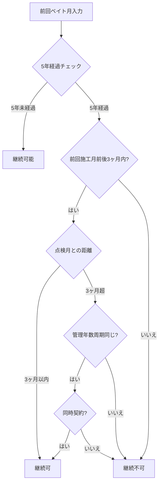
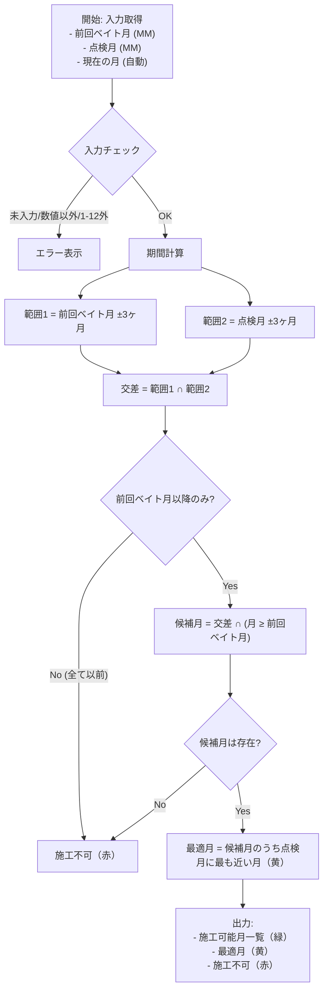
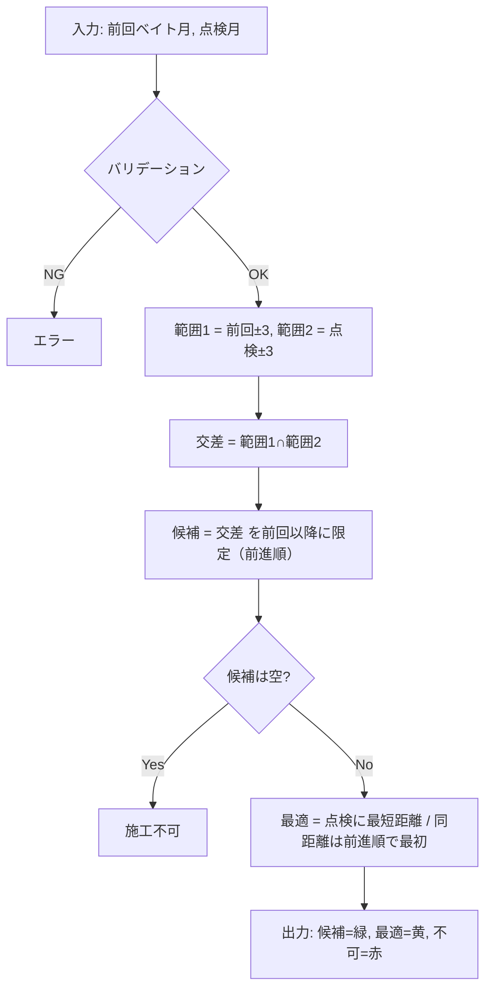

## 施工可能月チェッカー 要件定義（詳細）

### 1. 概要
本ドキュメントは、契約の整合性確認に基づき施工可能期間（月）を算出する「施工可能月チェッカー」の詳細要件を記述します。対象はまず Excel マクロ実装、将来的に Web 版への展開を想定します。

### 2. 背景と目的
- **背景**: 契約整合性確認が属人化し、判断ばらつきと効率低下が発生。
- **目的**: 判断基準の標準化、作業効率化、判断ミス削減。

### 3. 用語定義
- **前回ベイト月**: 直近のベイト施工が行われた月 (1-12)。
 - **点検月**: 点検の基準月 (1-12)。
- **現在の月**: システム日付から自動取得した月 (1-12)。
- **施工可能月**: ルールを満たす月の集合。
- **最適月**: 施工可能月のうち、点検月に最も近い月。

### 4. 入力要件
- **前回のベイト月 (必須)**
  - 形式: MM (1-12 の整数)
- **点検月 (必須)**
  - 形式: MM (1-12 の整数)
- **現在の月 (自動)**
  - 形式: MM (1-12 の整数)
- **プロダクト種別 (必須)**
  - 値: `単品継続` | `再消毒・セット`
  - 入力方法: セレクト（Excel ではデータ検証リスト）

### 5. バリデーション要件
- 必須項目が未入力の場合はエラー。
- 入力値が数値でない場合はエラー。
- 入力値が 1～12 の範囲外の場合はエラー。

### 6. 判定ルール（業務ロジック）
1. 工事日は、前回施工月の前後 3 ヶ月以内に施工する必要がある。（施工月の更新期間）
2. 工事日は、点検月の前後 3 ヶ月以内に施工する必要がある。
3. 工事日は、前回施工月を含み、それ以降の月とする。
4. 上記の条件を満たす範囲で、点検月に近い月を優先的に施工可能とする（最適月の決定）。

注意: 月の加減算は年を跨ぐため、月番号は 12 を法とした循環（モジュロ）で扱います（例: 11 の +3 は 2）。

### 7. アルゴリズム（算出手順）
1. 入力を検証（必須、数値、範囲）。
2. 前回ベイト月 ±3 ヶ月の範囲を計算（12 ヶ月循環）。
3. 現在の月が前回ベイト月前後3ヶ月内かどうかを判定。
4. 現在の月が点検月に遠ざからないかどうかを判定。
5. **判定基準**:
   - 前回施工月±3ヶ月以内 **かつ** 点検月に遠ざかっていない → 継続可
   - 前回施工月±3ヶ月以内だが点検月から遠ざかる → 継続不可
   - 前回施工月±3ヶ月の範囲外 → 継続不可
6. 施工可能月 = 前回ベイト月前後3ヶ月内で、点検月に遠ざからない月。
7. 最適月 = 施工可能月のうち、点検月に最も近い月。
8. 出力: 継続可否、施工可能月一覧、最適月、不可月。

擬似コード例（概念）:

```text
validate(prev, guar)
rangePrev = monthsWithin(prev, 3)
rangeGuar = monthsWithin(guar, 3)
intersection = rangePrev ∩ rangeGuar
candidates = filterAfterOrEqual(intersection, start=prev) // 循環順
if candidates is empty: return {possible: [], best: null}
best = argmin(candidates, distanceCircularTo(guar))
return {possible: candidates, best}
```

### 8. 出力要件
- テキスト出力:
  - 施工可能期間 (月) 一覧
  - 最適月 (月)
- カレンダー表示 (1～12 月, Excel 表示想定):
  - `A6` セルから横に 12 ヶ月分の枠を表示
  - 施工可能: 緑、最適: 黄、施工不可: 赤（Excel のセル塗りで表現）

### 9. 非機能要件
- **性能**: 整合性チェックは 3 秒以内。
- **可用性**: 可能な限り安定稼働。
- **保守性**: ルールと実装の分離、設定値（±3 ヶ月等）のパラメータ化。
- **セキュリティ**: 許可ユーザーのみアクセス（Web 化時）。
- **コスト**: まずは Excel マクロで個人開発。

### 10. 例（動作イメージ）

#### 10.1 施工可能月計算例
- 入力: 前回ベイト月 = 10, 点検月 = 1
  - 範囲1: 7-1（循環: 7,8,9,10,11,12,1）
  - 範囲2: 10-4（循環: 10,11,12,1,2,3,4）
  - 交差: 10,11,12,1
  - 候補月（前回以降）: 10,11,12,1
  - 最適月（点検=1 に最も近い）: 1

#### 10.2 ベイト継続可否判定例
- **ケース1**: 5年前の施工月前後3ヶ月内、点検月から3ヶ月以内
  - 判定: 継続可
- **ケース2**: 5年前の施工月前後3ヶ月内、点検月から3ヶ月超
  - 管理年数周期同じ + 同時契約 → 継続可
  - 管理年数周期異なる → 継続不可
- **ケース3**: 5年前の施工月前後3ヶ月外
  - 判定: 継続不可

### 13. システム化方針

#### 13.1 実装フェーズ
1. **Phase 1**: Excel マクロ版（個人開発）
   - 基本判定ロジック実装
   - 入力フォームと出力表示
2. **Phase 2**: Web アプリ版
   - データベース連携
   - 複数ユーザー対応
3. **Phase 3**: 統合システム版
   - 契約管理システム連携
   - 自動判定・通知機能

#### 13.2 技術要件
- **入力**: 前回ベイト月、点検月、管理年数、契約形態
- **処理**: 5年経過チェック、3ヶ月範囲判定、例外条件判定
- **出力**: 継続可否、施工可能月、最適月、判定根拠

#### 13.3 保守性向上
- 判定ルールの外部設定化
- パラメータ（3ヶ月、5年等）の設定可能化
- ログ出力による判定過程の可視化

### 11. ベイト販売基準概念（詳細）

#### 11.1 基本ルール
- **管理期間**: ベイトは5年管理
- **継続認定期間**: 5年前の施工月前後3ヶ月以内
- **点検月の概念**: 消毒工事の点検月（年1回）を顧客ごとに設定

#### 11.2 継続可否判定ルール
1. **基本条件**: 前回ベイト月前後3ヶ月内での施工
2. **点検月との整合性**: 点検月に遠ざからないこと
   - 点検月前後3ヶ月内での施工
   - 前回施工月から点検月方向への移動
   - 点検月から遠ざかる方向への移動は不可
3. **判定基準**: 
   - 前回施工月±3ヶ月以内 **かつ** 点検月に遠ざかっていない → 継続可
   - 前回施工月±3ヶ月以内だが点検月から遠ざかる → 継続不可
   - 前回施工月±3ヶ月の範囲外 → 継続不可

#### 11.3 判定フロー


#### 11.4 入力項目
- **前回ベイト月**: 1-12の整数
- **点検月**: 1-12の整数（消毒工事ベース）
- **管理年数**: ベイトと消毒の管理年数
- **契約形態**: 単独/同時契約フラグ

#### 11.5 出力判定
- **継続可**: 条件を満たす場合
- **継続不可**: 条件を満たさない場合
- **要確認**: 例外条件に該当する場合

### 12. 可視化（Mermaid フロー）

#### 12.1 ベイト継続可否判定フロー


#### 12.2 施工可能月計算フロー


### 12. 実装メモ（Excel マクロ想定）
- 入力セル: 前回ベイト月, 点検月（データ検証で 1-12 制約）
- 計算ロジック: VBA モジュールに分離、±3 ヶ月や色は定数で管理
- 表示: `A6:L6` に 1-12 月を描画し、候補/最適/不可でセル塗り分け

### 13. 変更管理
本ドキュメントは関係者との協議により変更される場合があります。

### 14. 確定事項と分岐方針（更新）
- **月は 12 ヶ月循環で扱う**（年跨ぎをモジュロ 12 で処理）。
- **現在の月は判定に使用しない**。
- **タイブレーク方針（近い将来月）**:
  - 候補月のうち、目標月（点検月など）との循環距離が同一の場合は、
  - 前回ベイト月からの前進順（前回→前回+1→…→12→1→…）で先に現れる月を優先。

### 15. 分岐設計：単品継続 と 再消毒・セット
本システムは、プロダクト構成により 2 系統のルールに分岐します。

#### A) 単品継続（ベイトのみ継続）
- 目的: ベイト単独での継続施工時期を判定。
- 参照する月: 前回ベイト月のみ。
- ルール:
  1. 施工月は「前回ベイト月 ±3 ヶ月」に含まれること（両端含む）。
  2. 施工月は「前回ベイト月以降」（前進順の同順序）であること。
  3. 最適月は、候補月のうち「近い将来月」を優先（点検月は参照しない）。
     - 推奨定義: 候補集合の中で前進順で最初に出現する月（= 最も早い将来月）。

出力: 候補=緑、最適=黄、不可=赤。

【A-詳細仕様】
- 候補月は厳密には次の 4 ヶ月に限定されます（12 ヶ月循環）:
  - {前回, 前回+1, 前回+2, 前回+3}
- 最適月は上記集合のうち、前回ベイト月に最も近い将来（前進順で最初）の月。
- 現在の月は判定に使用しません。

擬似コード（A）:

```text
function candidatesSingle(prev):
  return [prev, prev+1, prev+2, prev+3] // いずれも mod 12 正規化（1..12）

function bestSingle(prev):
  return prev // 前進順の最初は常に prev
```

Mermaid（A）:

```mermaid
flowchart TD
  A0[入力: 前回ベイト月] --> A1{バリデーション}
  A1 -- NG --> AE[エラー]
  A1 -- OK --> A2[候補 = {前回, 前回+1, 前回+2, 前回+3} (mod 12)]
  A2 --> A3[最適 = 前回ベイト月]
  A3 --> AO[出力: 候補=緑, 最適=黄, 不可=赤]
```

例（A）:
- 前回=10 → 候補: 10,11,12,1 / 最適: 10
- 前回=12 → 候補: 12,1,2,3 / 最適: 12

#### B) 再消毒・セット（ベイト＋再消毒／セット）
- 目的: ベイトと消毒の双方の条件を満たす施工時期を判定。
- 参照する月: 前回ベイト月、点検月。
- ルール:
  1. 範囲1 = 前回ベイト月 ±3 ヶ月。
  2. 範囲2 = 点検月 ±3 ヶ月。
  3. 候補 = 範囲1 ∩ 範囲2。
  4. 施工月は「前回ベイト月以降」（前進順）に限定。
  5. 最適月は、点検月に最も近い月（循環距離が最小）。
     - タイブレークは「近い将来月」方針（前回ベイト月からの前進順で早い方）。

出力: 候補=緑、最適=黄、不可=赤。

【B-詳細仕様】
- 範囲の定義（各 7 ヶ月幅・両端含む）:
  - rangePrev = {prev-3, prev-2, prev-1, prev, prev+1, prev+2, prev+3}
  - rangeInspect = {inspect-3, inspect-2, inspect-1, inspect, inspect+1, inspect+2, inspect+3}
  - いずれも 12 ヶ月循環（1..12 正規化）
- 候補 = rangePrev ∩ rangeInspect を、前回ベイト月からの前進順でスキャンし、以降のみを残す。
- 最適月の決定:
  1) 候補が空なら施工不可
  2) 距離 d(m) = min(|m-inspect|, 12 - |m-inspect|) の最小を持つ集合 tied を抽出
  3) tied のうち、前回ベイト月からの前進順で最初に現れる月を採用（近い将来月）

擬似コード（B）:

```text
function normalize(m):
  // 1..12 に正規化（例: 13→1, 0→12）

function monthsWithin(center, k=3):
  return [normalize(center+i) for i in [-k..k]]

function forwardOrderFrom(start):
  return [start, start+1, ..., 12, 1, 2, ..., start-1] // 正規化

function candidatesSet(prev, guar):
  r1 = set(monthsWithin(prev, 3))
  r2 = set(monthsWithin(guar, 3))
  inter = r1 ∩ r2
  order = forwardOrderFrom(prev)
  return [m for m in order if m in inter] // 以降のみ

function bestSet(prev, guar):
  cand = candidatesSet(prev, guar)
  if len(cand) == 0: return null
  // 最小循環距離を算出
  def dist(m): return min(abs(m-guar), 12-abs(m-guar))
  bestD = min(dist(m) for m in cand)
  tied = [m for m in cand if dist(m) == bestD]
  // 近い将来月（前進順で最初）
  return tied[0]
```

Mermaid（B）:



例（B）:
- prev=10, inspect=1
  - rangePrev: 7,8,9,10,11,12,1
  - rangeInspect: 10,11,12,1,2,3,4
  - 交差: 10,11,12,1 → 前回以降: 10,11,12,1 → 最適: 1（点検1に最短、同距離なし）
- prev=4, inspect=10
  - rangePrev: 1,2,3,4,5,6,7
  - rangeInspect: 7,8,9,10,11,12,1
  - 交差: 1,7 → 前回以降（4→…）: 7 → 最適: 7
- prev=2, inspect=8
  - rangePrev: 11,12,1,2,3,4,5
  - rangeInspect: 5,6,7,8,9,10,11
  - 交差: 5,11 → 前回以降: 2→3→4→5→…→12→1→…→ → 候補順: 5,11
  - 点検8との距離: dist(5)=3, dist(11)=3 → タイブレーク: 近い将来月 → 最適: 5

### 16. タイブレークの形式化
循環距離 dist_circ(a,b) = min(|a-b|, 12 - |a-b|)。
- 目標月 t（単品継続では t を参照しない。例: 点検月）。
- 同距離の月 m1, m2 が存在するとき、
  - 順序列 S = [前回ベイト月, 前回+1, …, 12, 1, …, 11] における出現順が早い方を採用。

擬似コード（最適月選定）:

```text
function chooseBest(candidates, targetMonthOrNull, previousBaitMonth):
  if targetMonthOrNull is null:
    // 単品継続: 近い将来月（最も早く到来）
    return firstInForwardOrder(candidates, start=previousBaitMonth)
  else:
    // 再消毒・セット: まず循環距離最小
    bestDistance = min(dist_circ(m, targetMonthOrNull) for m in candidates)
    tied = [m for m in candidates if dist_circ(m, targetMonthOrNull) == bestDistance]
    return firstInForwardOrder(tied, start=previousBaitMonth)
```

### 17. 分岐の可視化（Mermaid 概要）

```mermaid
flowchart TD
  S[開始: 入力取得] --> V{入力バリデーション}
  V -- NG --> E[エラー表示]
  V -- OK --> B{プロダクト種別}
  B -- 単品継続 --> A1[範囲=前回ベイト±3]
  A1 --> A2[候補=範囲 ∩ 前回以降]
  A2 --> A3[最適=前進順で最初]
  B -- 再消毒・セット --> C1[範囲1=前回ベイト±3]
  C1 --> C2[範囲2=点検月±3]
  C2 --> C3[候補=範囲1∩範囲2 ∩ 前回以降]
  C3 --> C4[最適=点検月に最短距離／同距離は前進順]
  A3 --> O[出力: 可能(緑)/最適(黄)/不可(赤)]
  C4 --> O
```


