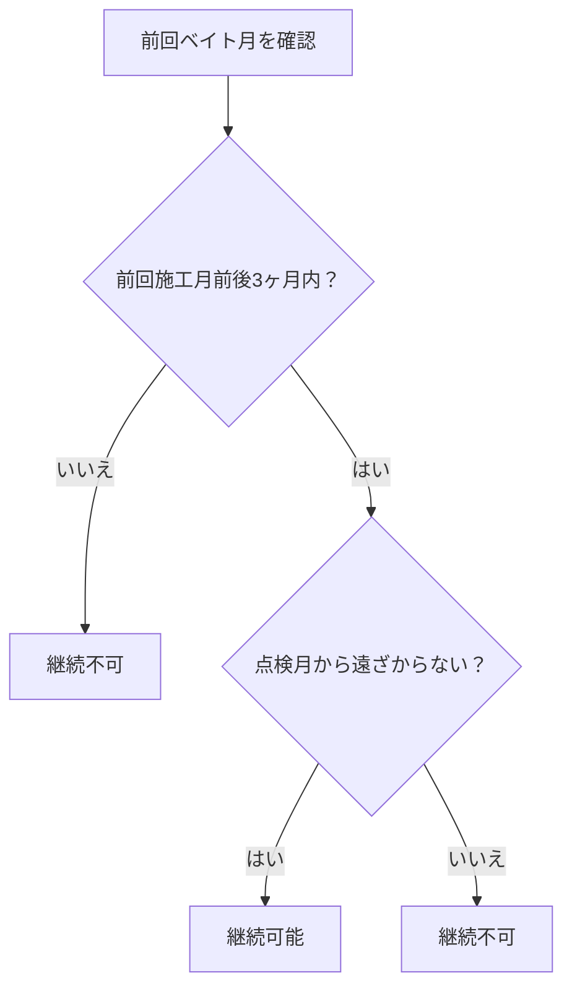

# ベイト販売基準の説明

## はじめに

このドキュメントは、ベイト工法の販売基準について、技術的な知識がなくても理解できるように説明したものです。

## ベイト工法とは？

ベイト工法は、害虫駆除のための工法で、定期的な施工が必要です。

## 基本的なルール

### 1. 管理期間
- **ベイト工法は5年ごとに管理**します
- 5年が経過すると、新しい契約が必要になります

### 2. 継続の条件
ベイト工法を継続するには、以下の2つの条件を満たす必要があります：

#### 条件1：前回施工月の範囲内
- 前回ベイト工事をした月の**前後3ヶ月以内**に施工する
- 例：8月に施工した場合、5月〜11月の間に次の施工が可能

#### 条件2：点検月との関係
- **点検月から遠ざからない**月に施工する
- 点検月とは、消毒工事の点検を行う月のこと

## 具体例で理解しよう

### 例1：継続可能な場合
```
前回ベイト月：8月
点検月：12月
現在の月：8月

→ 継続可能！
理由：8月は前回施工月（8月）の範囲内で、点検月（12月）方向に進んでいる
```

### 例2：継続不可な場合
```
前回ベイト月：9月
点検月：11月
現在の月：8月

→ 継続不可！
理由：8月は前回施工月（9月）の範囲内だが、点検月（11月）から遠ざかっている
```

## 判定の流れ



## 施工可能月の表示

システムでは、以下の色で月の状況を表示します：

- 🟢 **緑色（施工可能）**: 工事が可能な月
- 🟡 **黄色（最適）**: 最も適した施工月
- 🔴 **赤色（施工不可）**: 工事ができない月

## よくある質問

### Q: なぜ点検月から遠ざかってはいけないの？
A: 点検月に近い時期に施工することで、効率的な管理ができるためです。

### Q: 5年を過ぎたらどうなるの？
A: 5年を過ぎると、前回施工月の範囲内であっても継続できません。新しい契約が必要になります。

### Q: 同時契約とは？
A: ベイト工法と消毒工事を同時に契約することです。これにより、より柔軟な施工時期の調整が可能になります。

## まとめ

ベイト工法の継続には：
1. **前回施工月前後3ヶ月内**であること
2. **点検月から遠ざからない**こと

この2つの条件が重要です。システムを使うことで、これらの条件を簡単に確認できます。
